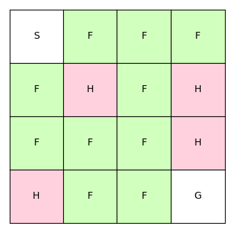
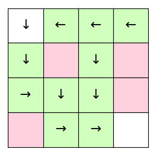

# Q-learning

## Introduction
Q-learning is a model-free reinforcement learning algorithm. 

A policy is a mapping from states to actions that tells what action
to perform when the environment is in a particular state. An action-value function ```Q```
assigns values to these state-action pairs. Q-learning is a method to learn an 
action-value function by directly approximating the optimal action-value function. A
neural network can be used as a function approximator.

## Environment
We use FrozenLake as an environment. The agent starts at S with the goal to
move to G. The agent can walk over the frozen surface F and needs to avoid
holes H:

.

The agent can take 4 possible actions:
```
LEFT = 0
DOWN = 1
RIGHT = 2
UP = 3
```
## Results
Learned actions using the action-value function after 1000 iterations:

.
