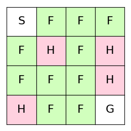

# Introduction
Q-learning is a model-free reinforcement learning algorithm. 

# Q-learning
A policy is a sequence of state-action pairs. An action-value function ```Q```
assigns values to these state-action pairs. Q-learning is a method to learn an 
action-value function by directly approximating the optimal action-value function. A
neural network can be used as a function approximator.

# Environment
We use FrozenLake as an environment. The agent starts at S with the goal to
move to G. The agent can walk over the frozen surface F and needs to avoid
holes H:

.

The agent can take 4 possible actions:
```
LEFT = 0
DOWN = 1
RIGHT = 2
UP = 3
```
# Results
The learned actions using the action-value function after 1000 iterations:

.


<!--
With a probability of  ``1-exploration.value(episode)`` the agent chooses a greedy policy.
Given the current action values ```q_values``` we use the greedy policy 
```argmax(q_values)```.

### Q-learning

https://www.cs.toronto.edu/~vmnih/docs/dqn.pdf

Q*(s,a): optimal action-value function

If the optimal value Q*(s',a') 


The optimal policy is to select the action a' maximizing the expected value of
r+ \gamma


```
r + gamma * Q*(s', a')
```


Estimate the action-value function doing an iterative update 


```python
next_q = reward + discount_rate * max_Q
```

Such value iteration algorihms converge to the optimal action-value function.


A non-linear function approximator is used to estimate the 
action-value function. This function approximator could be a neural network.
the neural network is trained by minimising the loss function

```python
(y - Q(s,a, parameter))^2
```


```python
y = reward + discount_rate * max(Q(s', a', params))
```
-->

